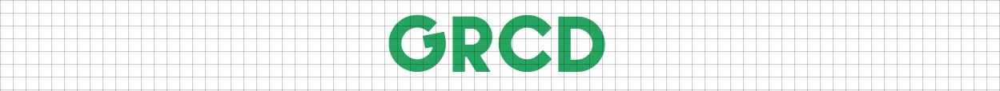

> Use grcd to add grids to your website.

[](http://inch-ci.org/github/chetanraj/grcd) 
[](http://codepen.io/chetanraj/full/yOgGxr/)
[](https://github.com/chetanraj/grcd)

To install grcd with Bower:

```
bower install grcd
```

### How to use

Use the minified ```grcd.min.js``` from the dist folder & place the following in the head of your document.

```js
{
	dependencies : jQuery Latest
};
```

### Setup

```js
$(function () {
    $.grcd();
});
```

will create a grid layer on your html page.

### default options

```js
$(function () {
    $.grcd({
        width: '16'
    });
});
```

### remove

```js
$.grcd.destroy();
```
